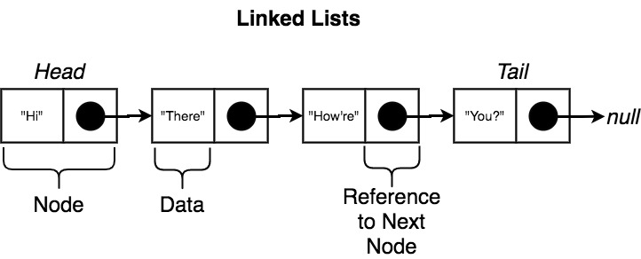

# Linked List

(This definition and exercise has been taken from [Coding Interview Bootcamp - Algorithms and Data Structures](https://www.udemy.com/course/coding-interview-bootcamp-algorithms-and-data-structure) by Stephen Grider).

## What is a Linked List?

A Linked List is a common data structure in programming. It is a ordered collection of data, where the collection contains a number of different nodes. Each node contains some amount of data, along with a reference to the next node. A collection of these nodes is called a Linked List, because they are quite literally linked in a chain. The list of nodes that form this chain have an order that is always maintained, they should never randomly change unless you explicitly tell them to.



A very simple Linked List code example:

```js
// node1 will be first in the chain 
// it's known as the 'Head' 
const node1 = {
  data: 123  
}

const node2 = {
  data: 456
}

// node3 will be last in the chain 
// it's known as the 'Tail' 
const node3 = {
  data: 789
}

// As well as data, each node should have a reference to the next node in the chain
node1.next = node2
node2.next = node3
node3.next = null // node3 is the Tail, so it doesn't have a next 
```

## Exercise 1

**Note:** *An understanding of [ES6 classes](https://developer.mozilla.org/en-US/docs/Web/JavaScript/Reference/Classes) is needed to do this exercise.* 

Create a proper Linked List implementation using JavaScript. 

The setup files are in the [exercise-1](https://github.com/FACN7/interview-prep/tree/master/exercises/linked-list/exercise-1/) directory:
- Write your code in `index.js` (there is already a basic template)
- Run `npm run test:exercise1` to check your code is correct
- Use `directions.html` to see what properties and methods should be present on your class
- If you are really stuck, look at the solution file in `solutions/solution.js`

## Exercise 3

Write a function `midpoint()` that takes an instance of a LinkedList (of unknown length), and returns the 'middle' node.

- If the list has an even number of elements, return the node at the end of the first half of the list. eg: `[1, 2, 3, 4, 5, 6] -> 3`
- You are **not** allowed to use `LinkedList.size()` 
- You are **not** allowed to use `LinkedList.getAt()`
- You must only iterate through the array once - O(n)

The setup files are in the [exercise-3](https://github.com/FACN7/interview-prep/tree/master/exercises/linked-list/exercise-3/) directory:

- Write your code in `index.js` (there is already a basic template)
- You already have a implementation of a LinkedList inside `linkedlist.js`, you shouldn't need to add any more methods to this
- Run `npm run test:exercise3` to check your code is correct

<details><summary>HINT (don't read straight away)</summary>
<p>
Have you tried the <a href="https://www.geeksforgeeks.org/write-a-c-function-to-print-the-middle-of-the-linked-list/">fast & slow</a> method?
</p>
</details>